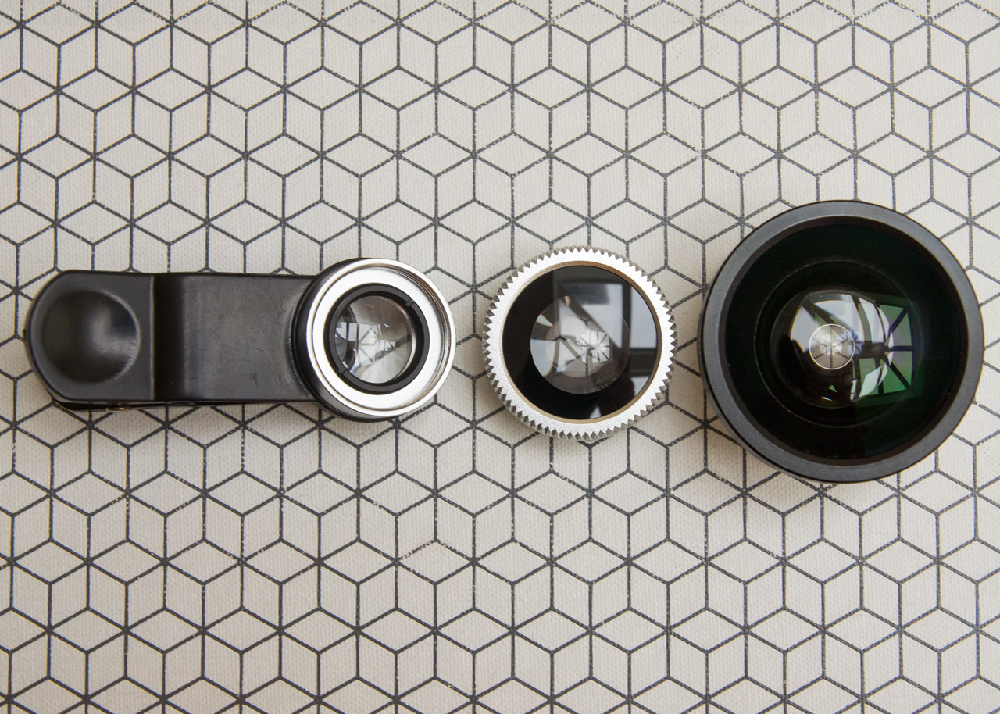
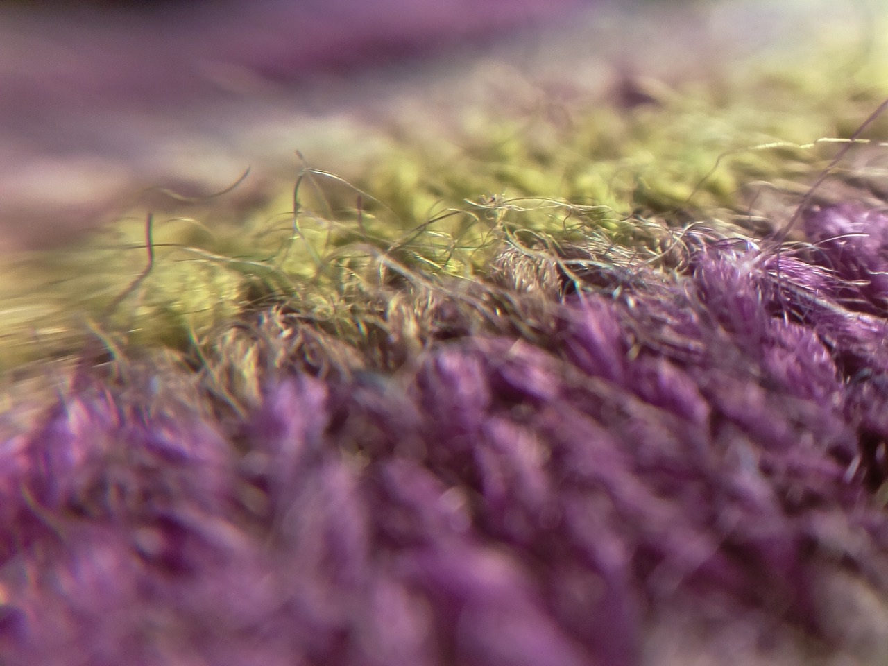
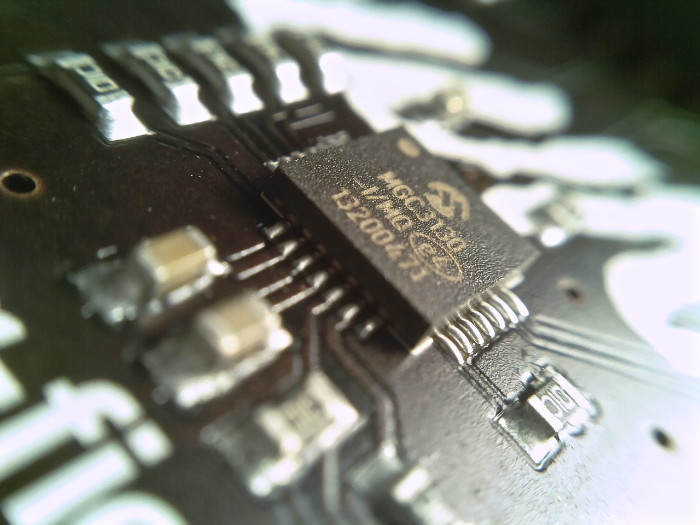

## Raspberry Pi camera lenses

This short guide will show describe how to use the set of three camera lenses,
available in the Pimoroni shop, with the Raspberry Pi camera.

As you'll see in the photo below, there are three lenses, although when you
first open the box, the fisheye lens will be screwed onto the macro lens, so
you'll need to unscrew it to use the macro. Took me a while to work that one
out! To use the wide angle lens, just unscrew the fisheye and screw the wide
angle lens on.



The lenses just clip over the Raspberry Pi camera board, as in the photo below.
You might want to fiddle about with the placement of the lens to get it just
the way you want.

## Setting the camera up

You'll need to connect the camera to your Raspberry Pi with the ribbon cable,
plugging it into the CSI connector on the Pi. If it doesn't work first time,
the cable is probably the wrong way round; just turn it round and it should
work.

You'll also need to enable the camera in the `raspi-config`. To do this, open
a terminal and type `sudo raspi-config`. Select `Enable camera`, then enter,
then select `Finish`. It'll ask if you want to reboot and, once you do, the
camera should be enabled.

To take a still picture, in the terminal, type the following:

```bash
raspistill -o mypicture.jpg
```

Of course, you can also record video, by typing the following:

```bash
raspivid -o myvideo.h264
```

This will record a 5 second video be default, but you can specify the time with,
for example, `-t 10000`, which will record for 10,000 milliseconds, or 10
seconds.

Full instructions on using the Pi camera can be found
[here](https://www.raspberrypi.org/documentation/usage/camera/README.md).

## Examples

The quality of images from these lenses is remarkably good. Here are some macro
images that I took, below, of some wool and one of the Pimoroni HATs. All that's
been done to the images below is some sharpening and white balance correction,
as the Pi camera sometimes has a bit of a strange colour cast.




