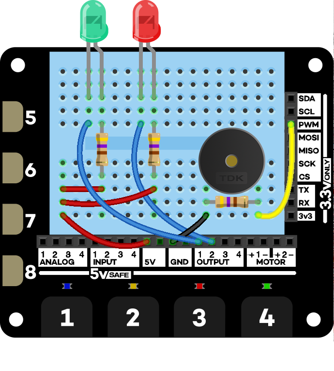

# Create a PIN entry system with the Explorer HAT Pro

This beginners tutorial will teach you how to combine a couple of different output 
devices with the capacitative touch buttons on the 
[Pimoroni Explorer HAT/Explorer HAT Pro](http://shop.pimoroni.com/products/explorer-hat),
to create a fun little PIN entry system that will flash LEDs and buzz a buzzer when
a correct/incorrect code is entered.

We'll learn how to connect up and control LEDs using the Explorer HAT outputs and a little
piezo buzzer using the PWM (pulse width modulation) channel of the Raspberry Pi that's 
broken out on the Explorer HAT.

Here's what you'll need:

* A Raspberry Pi A+/B+/2
* [Pimoroni Explorer HAT/Explorer HAT Pro](http://shop.pimoroni.com/products/explorer-hat)
* A handful of 470 Ω resistors (at least three)
* A couple of coloured 5mm LEDs (ideally green and red)
* A piezo electric buzzer
* A bunch of jumper leads

**Note that you can get all of these in the Pimoroni Explorer HAT Pro parts kit.**

# Getting the software set up

If your Explorer HAT/Explorer HAT Pro isn't set up yet, you'll need to do the following:

```bash
curl get.pimoroni.com/i2c | bash
sudo apt-get install python-smbus
sudo apt-get install python-pip
sudo pip install explorerhat
```

Those commands will install set up I2C and install the Explorer HAT Python library.

Next, you'll want to plug your Explorer HAT into the 40 pin GPIO connector on your
Raspberry Pi. You can check it's working by typing the following straight in the 
terminal:

```bash
sudo python -c 'import time, explorerhat; explorerhat.light.on(); time.sleep(1); explorerhat.light.off()'
```

That should light up all four of the LEDs on the Explorer HAT board for a second and then
switch them all off again. If that works, then your Explorer HAT is good to go!

# Connecting the components up

The wiring diagram is shown below.

Make sure that you connect the LEDs up the right way round, with the long leg - the anode - 
connected via the resistor to the 5V supply and the shorter leg connected to the output channel. 
The resistors connected to the LEDs are voltage-limiting resistors and reduce the 5V supply to a 
safe voltage for the LEDs. The piezo buzzer and the resistors can be connected up any which way 
you'd like.



# The code

Whenever I'm writing some code to solve a problem, I like to write out a rough plan of what I
need to do - they call it pseudo-code in the trade. Here's what we need to do:

* Set a four digit PIN code
* Keep track of the button numbers pressed
* Give some visual feedback when the buttons are pressed
* When four numbers have been entered, check whether the PIN is correct
* If the PIN is correct, blink the green LED and play a high tone on the buzzer
* If the PIN is incorrect, blink the red LED and play a low tone on the buzzer
* Whenever four digits have been entered, wipe the list of entered digits clean
* Print out some feedback to the terminal

You can clone my fork of the Pimoroni Explorer HAT Python library which includes the code below
for the PIN entry system, but I'll also walk you through the code bit-by-bit so that you can
understand what's going on.

Here's how to clone and run it:

```bash
git clone https://github.com/sandyjmacdonald/explorer-hat.git
cd explorer-hat/examples
sudo python pin_entry.py
```

And here's the code in full:

```python
import time
import explorerhat as eh
import RPi.GPIO as GPIO

GPIO.setmode(GPIO.BCM)
GPIO.setup(18, GPIO.OUT)
buzzer = GPIO.PWM(18, 400)

correct_pin = [1,2,3,4]
pin = []

def add_to_pin(channel, event):
        if channel > 4:
                return
        if event == 'press':
                global pin
                pin.append(channel)
                eh.light[channel-1].on()
                time.sleep(0.05)
                eh.light[channel-1].off()

try:
        while True:
                while len(pin) < 4:
                        eh.touch.pressed(add_to_pin)
                        time.sleep(0.05)
                if pin == correct_pin:
                        print 'PIN correct!'
                        for i in range(5):
                                buzzer.ChangeFrequency(400)
                                buzzer.start(50)
                                eh.output.one.on()
                                time.sleep(0.1)
                                buzzer.stop()
                                eh.output.one.off()
                                time.sleep(0.1)
                else:
                        print 'PIN incorrect! Try again.'
                        for i in range(5):
                                buzzer.ChangeFrequency(50)
                                buzzer.start(50)
                                eh.output.two.on()
                                time.sleep(0.1)
                                buzzer.stop()
                                eh.output.two.off()
                                time.sleep(0.1)
                pin = []

except KeyboardInterrupt:
        pass

except Exception:
        pass

finally:
        GPIO.cleanup()
```

It's really not much code at all to set up such a nice little system, and no doubt it
could be written a tad more efficiently with a couple more functions.

Here's a walk-through of what it all does.

## Imports

```python
import time
import explorerhat as eh
import RPi.GPIO as GPIO
```

Here, the `time` module is used to introduce some delays into our code. It's always a good
idea to have some very short delays when running this kind of code to stop things 
from getting crazy. I tend to use a 0.05 second delay.

We `import explorerhat as eh` simply to saving us typing `explorerhat` in full every
time we need to use one of it's functions or classes.

Last, we need `RPi.GPIO` to control our piezo buzzer with PWM.

## Setting up RPi.GPIO

```python
GPIO.setmode(GPIO.BCM)
GPIO.setup(18, GPIO.OUT)
buzzer = GPIO.PWM(18, 400)
```

These first two lines, first, set the GPO pin numbers to the Broadcom numbering and, second, 
setup GPIO pin 18 as an output. The PWM channel on the Explorer HAT is connected to GPIO pin 
18 on the Raspberry Pi, to which we'll connect our buzzer.

The last line creates a PWM object called `buzzer` using pin 18 and sets the frequency to
400 Hz. We can use this `buzzer` object to control out buzzer later.

## Setting our PIN

```python
correct_pin = [1,2,3,4]
pin = []
```

We create list with the correct PIN that we want to match, and an empty list to which
we can add the entered numbers. Whenver four digits have been added, we'll empty this
list.

## Entering digits

```python
def add_to_pin(channel, event):
        if channel > 4:
                return
        if event == 'press':
                global pin
                pin.append(channel)
                eh.light[channel-1].on()
                time.sleep(0.05)
                eh.light[channel-1].off()
```

We create a short function to do three things: detect which button has been pressed,
add that number to out `pin` list, and blink the curresponding light briefly to give
some visual feedback when the button has been pressed.

We'll pass this function to the `eh.touch.pressed()` method later and in turn it will
pass in the channel number that has been pressed and what type of event it was to 
our `add_to_pin` function.

The `if channel > 4: return` means that only the buttons 1-4 along the bottom edge can
be used, although you could easily remove this `if` if you wanted to use all eight digits.

We have to specify that the `pin` list is a global so that we can access it everywhere, 
then we append the number entered to the list. The `eh.light[channel-1].on()` turns
on the LED above the corresponding button pressed, the `time.sleep(0.05)` keeps the
LED on briefly, and then the `eh.light[channel-1].off()` turns it off again. We have
to subtract 1 from the channel, since the channels are indexed from 1 and the LEDs
from 0.

## Try, except, finally

We use `try`, `except` and `finally` since this allows us to try to run our main code,
catch any exceptions with `except` which keeps things a little cleaner, and then use
the `finally` to run the `GPIO.cleanup()` which is essential to avoid problems when
using the RPi.GPIO library.

## Detecting touches and adding numbers to the pin list

```python
while True:
        while len(pin) < 4:
                eh.touch.pressed(add_to_pin)
                time.sleep(0.05)
```

`while True` ensures that this block of code will keep running until we break out of
the program with `control-c`. We want to add digits to the `pin` list as long as the
list has less than 4 digits in it, and the `eh.touch.pressed(add_to_pin)` runs our
`add_to_pin` function whenever a touch is detected, adding the digit to the `pin` list
and giving the visual feedback blink. As before, the `time.sleep(0.05)` avoids any
strange behaviour.

## Your PIN is correct! :-)

The previous `while len(pin) < 4` will break out as soon as 4 digits have been entered
and the next thing we want to do is to check whether the PIN is correct or incorrect
and react accordingly.

```python
if pin == correct_pin:
        print 'PIN correct!'
        for i in range(5):
                buzzer.ChangeFrequency(400)
                buzzer.start(50)
                eh.output.one.on()
                time.sleep(0.1)
                buzzer.stop()
                eh.output.one.off()
                time.sleep(0.1)
```

This block does quite a bit.

First, we check whether the `pin` entered matches the `correct_pin`. If it does, then we 
print a message telling the user so.

Then we have a `for` loop that runs five times. Each time, it sets the buzzer frequency to 
a high tone with `buzzer.ChangeFrequency(400)` and then starts the buzzer with `buzzer.start(50)`.
At the same time, we switch the green LED connected to output 1 on with `eh.output.one.on()`.
The `time.sleep(0.1)` means that the buzzer will sound and the LED will light for 0.1 seconds.

Lastly, we turn the buzzer off with `buzzer.stop()`, turn the LED off with `eh.output.one.off()`,
and have another `time.sleep(0.1)` delay where nothing happens.

This loop runs five times, so the light will flash and buzzer buzz intermittently five times for 
a total of 1 second.

## Your PIN is incorrect. :-(

This `else`block is essentially the same as the previous block, except that it blinks the other 
red LED and buzzes at a lower frequency to signal an incorrect PIN.

```python
else:
        print 'PIN incorrect! Try again.'
        for i in range(5):
                buzzer.ChangeFrequency(50)
                buzzer.start(50)
                eh.output.two.on()
                time.sleep(0.1)
                buzzer.stop()
                eh.output.two.off()
                time.sleep(0.1)
```

Lastly, we have to reset our `pin` list to an empty list, ready for the next four digits to
be entered, `pin = []`, at the end of this iteration of the `while True` loop.

And that's it! Play with it, and then I encourage you to hack it to make it better.

# Going further

I can think of loads of ways to make this better.

You could make it so that you can enter a PIN at the terminal when the program first runs,
rather than having to set it within the code.

You could limit the user to a certain number of tries before they get locked out.

You could use this as a way to trigger something else, e.g. a tweet, a status update on
Facebook, or send an email. Each user could have their own PIN that would trigger an
event specific to that user.

**GO FORTH AND HACK, INTREPID EXPLORER!**