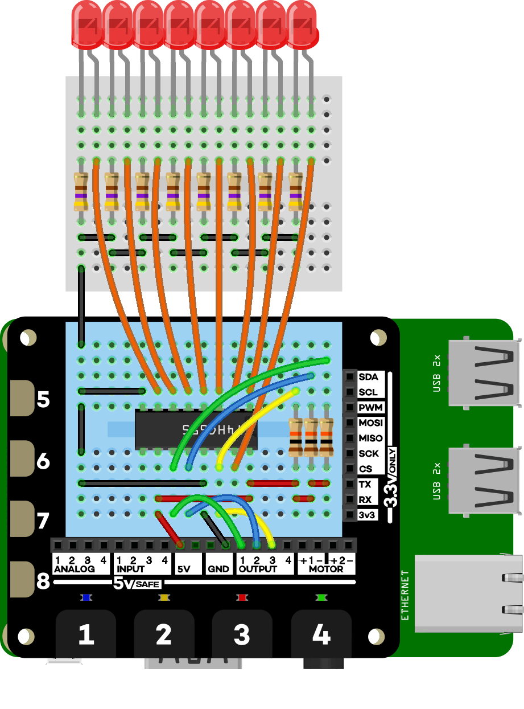

# Control LEDs with Explorer HAT and an 8-bit shift register

This intermediate tutorial will show you how to use Explorer HAT to control
8 LEDs (or even more...) from just 3 output pins. Because Explorer HAT has just
4 output pins, normally, you would be able to control only 4 LEDs, but the 8-bit
shift register is a cunning little bit of kit. The wiring here is a bit of a
logistical nightmare, but hopefully with the wiring diagram you'll manage.

# 8-bit shift registers for dummies

In very simple terms, the 8-bit shift register has a series of 8 on/off switches
that can hold the values 0 (off) or 1 (on). These 8 bits make 1 byte and can encode
integer values up to 255 in binary. Each of these 8 bits are filled up one-by-one
and shifted along each time a new one is filled, hence the name shift register. 
There are two latch pins that lock in these bits, the shift register clock (SRCLK) 
and the storage register clock (RCLK), as well as a serial (SER) pin that sets each
bit on or off.

Each of the 8 bits controls one output pin, and we'll use these 8 output pins to 
control our 8 LEDs. This method of controlling multiple output pins with only a 
few input pins is known as serial-in-parallel-out (SIPO) as the information is
passed in serially (the 8 bits) and then sent out in parallel (the states of the
8 output pins are updated at the same time).

There's a slight complication with using Explorer HAT to control the shift register,
in that we need to be able to set the output pins to high or low, and the Explorer
HAT's output pins get pulled to ground (low) when they are switched on rather than
high. Fortunately, there's an easy solution - pull-up resistors - which will pull
the output pins to high when they are off, meaning that off is on and on is off.
These are simple to connect up, we just connect the three input pins of the shift
register up to three of the Explorer HATs out pins and also connect each of these
to the 5V supply from Explorer HAT via a 10 kΩ resistor.

# Setting the hardware up

We need quite a few things to set this all up:

* A Raspberry Pi A+/B+/2
* [Pimoroni Explorer HAT/Explorer HAT Pro](http://shop.pimoroni.com/products/explorer-hat)
* 74HC595 8-bit shift register
* 8 5mm LEDs
* 8 470 Ω resistors
* 3 10 kΩ resistors
* A mini breadboard or 400 point (half-size) breadboard
* A bunch of jumper leads

Note that you can get all of this, with the exception of the Raspberry Pi, Explorer HAT
and mini breadboard, in the 
[Explorer HAT Pro parts kit](http://shop.pimoroni.com/products/explorer-hat-pro-parts-kit).

I've set this up a couple of different ways. In the wiring diagram below, I've put the 
LEDs and voltage-limiting resistors on one mini breadboard and the shift register and
pull-up resistors on the mini breadboard on Explorer HAT. You can, and I have, put
everything on the same mini breadboard, but the wiring is a complete nightmare!
If you want everything on the same breadboard, then I'd suggest using a larger 
half-size breadboard.

Here's the wiring diagram.



I connected the shift register clock (SRCLK) pin to output one on Explorer HAT, the
storage register clock (RCLK) pin to output two and the serial (SER) pin to output three,
but this doesn't matter as long as you specify the pins correctly in the Python code.

# Setting the software up

I've created a new plugins module, in my fork of the Explorer HAT Python library, that
contains a `ShiftRegister` class with methods for toggling the pins on or off and a few
different patterns to use with LEDs.

Here's how to clone and install my fork:

```bash
git clone https://github.com/sandyjmacdonald/explorer-hat.git
cd explorer-hat/library
sudo python setup.py install
```

I'll explain below how to use the `ShiftRegister` class and how it works, but if 
you're impatient, or just want to make sure that you've connected it all up correctly,
then you can start an interactive Python prompt by typing `sudo python` and pressing return 
(the `sudo` is important as you need it to be able to interact properly with Explorer HAT).
Type the following to run a demo of the `ShiftRegister` class:

```python
from explorerhat import plugins

shiftreg = plugins.ShiftRegister()
shiftreg.demo()
```

This should blink all 8 LEDs on and off 5 times, run along the line of LEDs 5 times,
alternately blink the odd and even LEDs 5 times and run back and forth along the line
of LEDs 5 times.

# How it works and how to use the ShiftRegister class

Here's the basic function from the `ShiftRegister` class that toggles a pin on or off:

```python
import explorerhat

srclk = explorerhat.output.one
rclk = explorerhat.output.two
ser = explorerhat.output.three

def toggle_pin(pin, state):
	rclk.on()
	for p in range(8):
		srclk.on()
		if p == pin:
			if state == 1:
				ser.off()
			else:
				ser.on()
		else:
			if state == 1:
				ser.on()
			else:
				ser.off()
		srclk.off()
	rclk.off()
```

So, if you want to toggle on LED 1 (remember that indices begin from 0 in Python, so
pin 1 is actually pin 0) you would simply use `toggle_pin(0, 1)`. Note that the `state`
variable uses 0 for off and 1 for on in this function.

We'll break down how the function works.

Outside our function, we import the `explorerhat` library and define our `srclk`, `rclk`
and `ser` pins.

The `toggle_pin` function takes two variables - `pin` and `state` - that define the pin
we want to toggle and whether to toggle it off or on (0 or 1 respectively).

Remember that the pull-up resistors reverse what is happening with the output pins, so 
when it says on in the function, that's actually off and vice versa.

We toggle the storage register clock pin, `rclk`, off to begin with `rclk.on()`. 

Then for each output pin, `for p in range(8):`, we first toggle the shift register
clock, `srclk`, off with `srclk.on()`.

Then we check whether it's the pin we want to
toggle on or off with `if p == pin:`. If it is, we check whether to toggle it on 
with `if state == 1:` and switch the serial pin, `ser`, on with `ser.off()`, otherwise
we switch it off with `ser.on()`.

We toggle the shift register clock, `srclk`, on.

We then go through the remainder of the eight pins, doing the same as we did above -
toggling the shift register clock off, checking whether it's the pin we want to 
toggle on or off and then toggling the serial pin accordingly, and toggling the shift 
register clock on each time.

Finally, we toggle the storage register clock pin, `rclk`, on, to shift out all of the
bits we stored.

So, that's how the basic function to toggle a single output pin on or off works. 
Obviously, if we wanted to toggle several pins simultaneously, this function wouldn't
do, because if we toggle one pin on, it assumes we want to toggle all of the others off.
 
To toggle all of the pins on or off, we'd just have the same function, with the 
same `for p in range(8):` loop, but exclude the `if p == pin:` and `else`, as follows:

```python
def toggle_all(self, state):
	rclk.on()
	for p in range(8):
		srclk.on()
		if state == 1:
			ser.off()
		else:
			ser.on()
		srclk.off()
	rclk.off()
```

In the Explorer HAT Python plugins module that I've written, there's a `ShiftRegister` 
class that can be used to control the shift register with a number of methods of the 
class (they're just functions that belong to the class). This allows us to create 
objects assigned to a variable, e.g. `shiftreg = plugins.ShiftRegister()`, and then
run the methods within the class, like the demo method, with `shiftreg.demo()`.

# Other methods of the ShiftRegister class

Here's the full list of methods available so far in the `ShiftRegister` class:

```python
shiftreg.toggle_pin()	# Toggle a single pin
shiftreg.toggle_all()	# Toggle all of the pins
shiftreg.toggle_odd()	# Toggle the odd numbered pins
shiftreg.toggle_even() 	# Toggle the even numbered pins
shiftreg.chase()		# Toggle all the pins sequentially in one direction
shiftreg.scan()			# Toggle all the pins sequentially back and forth
shiftreg.demo()			# Runs all of the above
```

It's simple to add your own method to the `ShiftRegister` class. You just need to 
remember a few things. First, it needs to be within the `ShiftRegister` class, i.e.
indented a level further in than the first line of the class, where it says 
`class ShiftRegister:`. Next, it looks just like a normal Python function, in that 
it begins with `def method_name():`, except that you must always pass `self` as the
first argument like so: `def method_name(self, arg1, arg2):`. You need to pass `self`
even if you're not passing any other arguments in, as I have in the previous example.

As long as you follow the pattern I showed above to set the pins - toggle the storage
register clock off then for each pin, toggle the shift register clock off, the serial 
pin on or off and the shift register clock on, and finally toggle the storage register 
clock back on - then the world is your lobster (or oyster, or whatever)!

# Taking it further

It's possible to daisy-chain the 8-bit shift register chips together to drive even more
LEDs from the same 3 output pins. You'd just connect up the last output pin of one chip
to the serial input pin of the second chip and connect up the other two input pins, the
storage register clock and the shift register clock, from the two chips, so that they 
switch on and off at the same time.

I won't show you how to do that here, and you'd have to modify the code to do it, but I 
encourage you to give it a try!