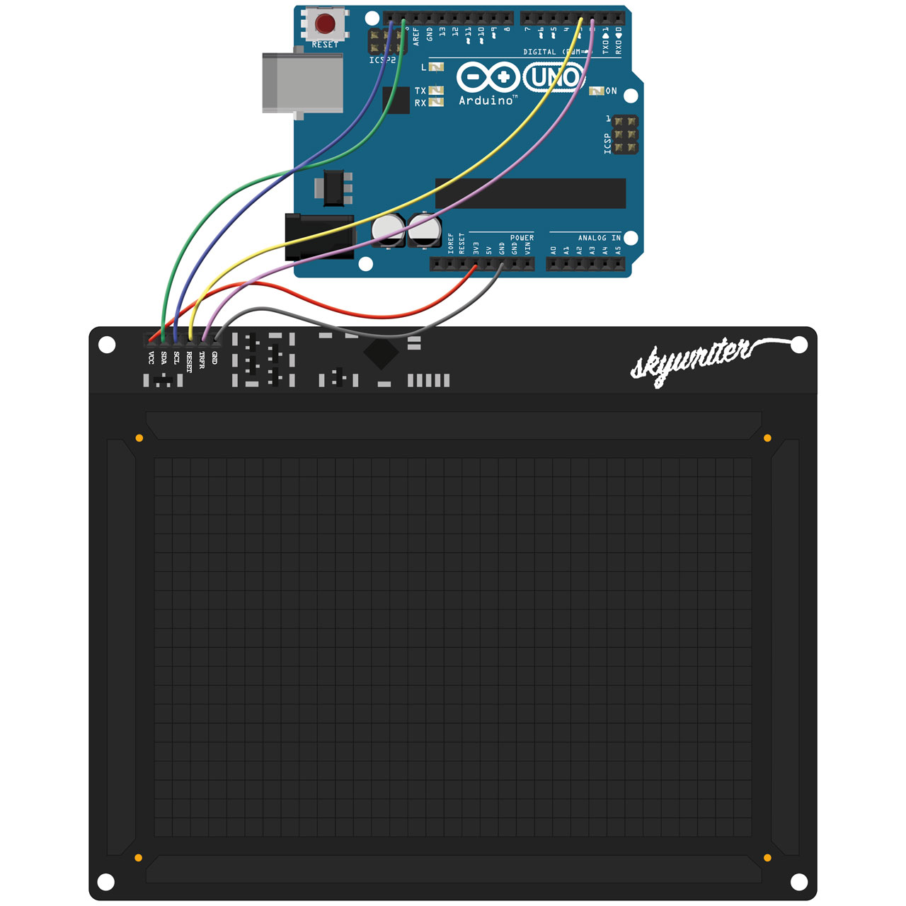
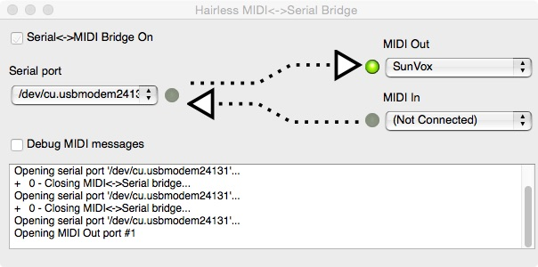
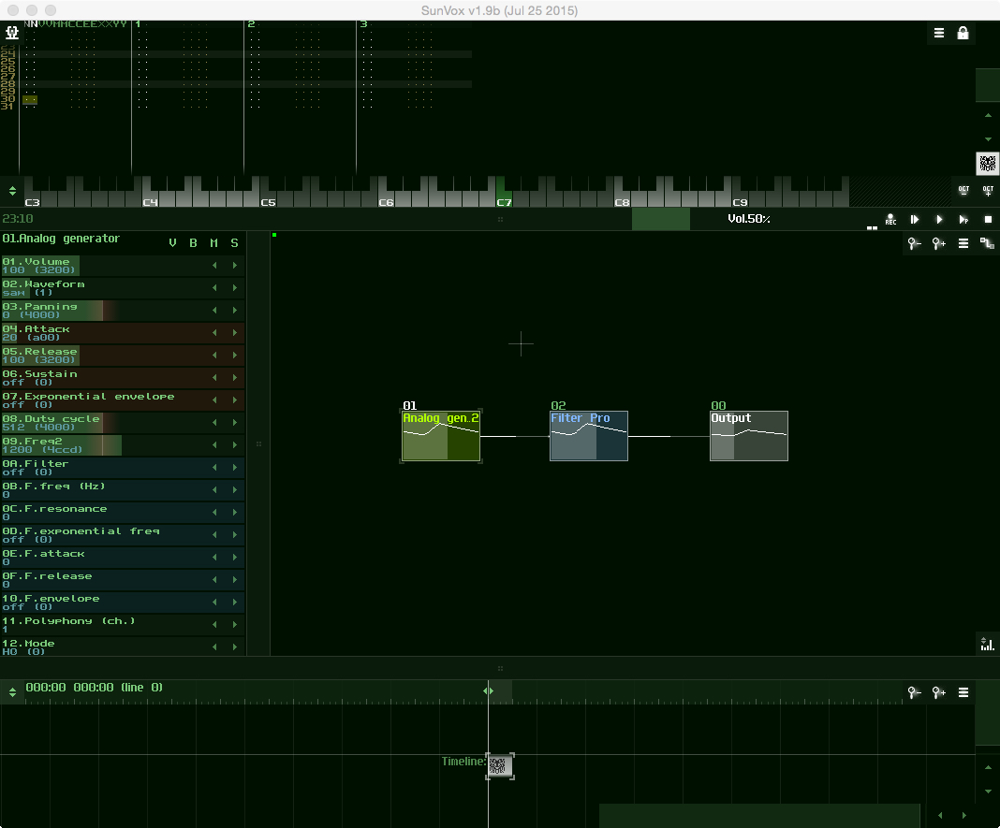
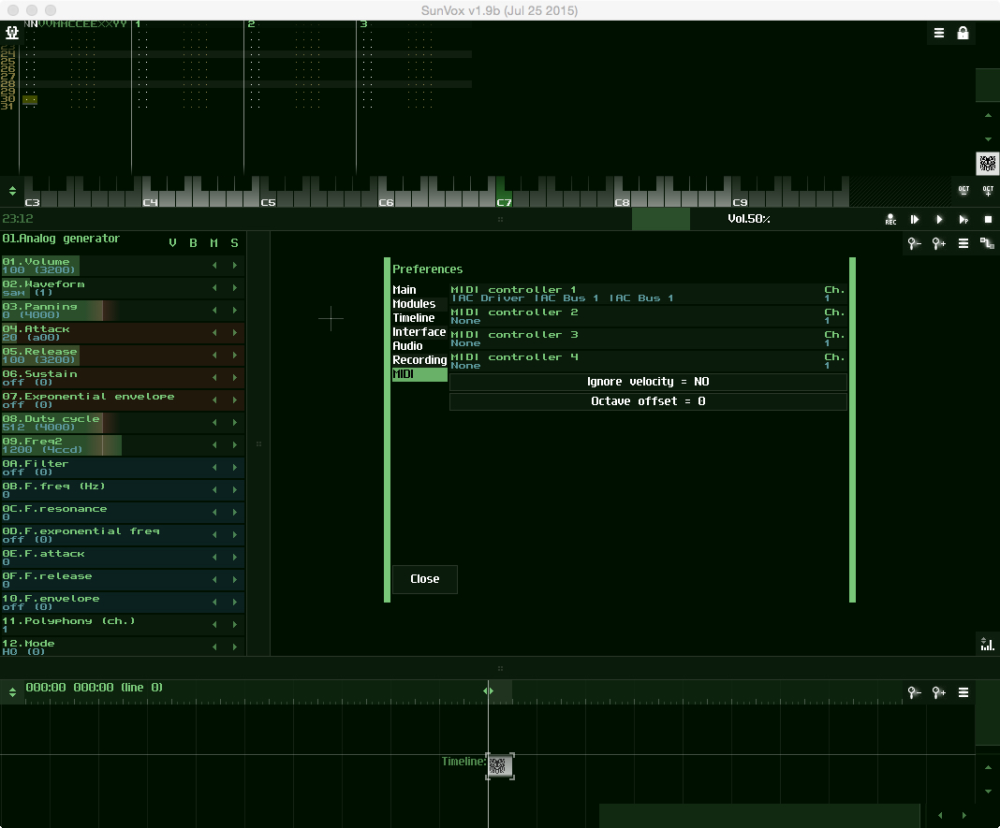

## Skywriter midi instrument

This quick guide will show you how to set up the large-sized Skywriter as a
midi instrument with an Arduino Uno, letting you control the pitch and volume
by moving your hand above the Skywriter.

Skywriter detects movement in three axes, and up to around 15 cm above the
surface, making it a little bit more flexible as an instrument than the
smaller Skywriter HAT.

Combined with an Arduino Uno, you can generate serial messages,
use a software converter to convert the serial messages to midi messages, and
then send those midi messages to a software synth or even a hardware synth. The
advantage of the Arduino Uno is that you can supply power and send the serial
messages over the same USB A to B cable.

## Wiring up the Skywriter and Arduino Uno

First, you'll need to solder some female header to the Skywriter, so that you
can connect the Skywriter to the Arduino Uno with some jumper cables. You'll
need 6 jumper cables altogether, for power, ground, SDA and SCL (I2C), TRFD
and RESET.

We'll use the 3V3 power, although you could safely use the 5V too. We'll
connect the SDA and SCL to pins 27 and 28 respectively (the green and blue
wires in wiring diagram below). We can define which pins will be used for
TRFR and RESET in the Arduino sketch, but I've used pins 2 and 3 respectively
(pink and yellow in the diagram).



You'll need a USB A to B cable (commonly known as a USB printer lead) to power
the Arduino Uno. I use one of the Sparkfun Cerberus cables, which has a standard
USB A connector at one end and B, mini-B and micro-B on the other. It means that
I can leave a single cable plugged in to my computer and power and/or
communicate with pretty much any microcontroller I like.

## Setting up the Arduino IDE

You'll need to download and install the Arduino IDE, to allow you to upload the
sketch (the code that will run on the Arduino) to the Uno. You can download the
most up to date version [here](https://www.arduino.cc/en/Main/Software).

Once you've done that, you'll need to go to the "Tools" menu and, under
"Board", select "Arduino/Genuino Uno". Then make sure that you've selected the
USB port to which you've connected the Uno under "Port".

We'll need to install a couple of libraries that we'll use in the sketch to
use the Skywriter and to handle the midi messages.

The first is the Skywriter Arduino library, which you can find
[here](https://github.com/pimoroni/skywriter-hat/tree/master/arduino). You'll
need to drop the folder named `Skywriter` into your `Arduino/libraries/` folder.

The second is the Arduino midi library, which you can find
[here](https://github.com/FortySevenEffects/arduino_midi_library). Again, drop
this into your `Arduino/libraries/` folder. Both this midi library and the
Skywriter library have instructions on how to install them on their respective
GitHub readme files.

You'll probably need to restart the Arduino IDE once you've installed the
libraries, in order for them to show up.

## The Hairless MIDI to Serial Bridge

Because our Arduino sketch will send messages over serial to your connected
computer, we'll need to catch those serial messages and convert them to midi
messages. Fortunately, there's a fantastic piece of software that does just
that job, and has Mac, Linux and Windows versions. Here's the
[link](https://projectgus.github.io/hairless-midiserial/), where you'll also
find full documentation.

It's really as simple as installing the software, opening it, selecting the
serial port, which will be the same USB port that you selected in the Arduino
IDE, and then selecting the midi out destination. More on that soon.



## Our Arduino sketch

At the very top of our sketch, we import the libraries that we'll be using:

```c
#include <Wire.h>
#include <MIDI.h>
#include <skywriter.h>
```

The Wire library is used for the serial data, the MIDI for the midi, and the
skywriter for the Skywriter, naturally.

Next, we need to define a few variables:

```c
MIDI_CREATE_DEFAULT_INSTANCE();

unsigned int max_x, max_y, max_z;
unsigned int min_x, min_y, min_z;
```

We create a default midi instance that we can work with later, and then some
integers for the min and max x, y and z coordinates.

Our `setup` function sets up some specific aspects of the three libraries:
serial, midi and Skywriter:

```c
void setup() {
  MIDI.begin(1);
  Serial.begin(115200);
  Skywriter.begin(2, 3);
  Skywriter.onXYZ(handle_xyz);
}
```

The `MIDI.begin(1)` line starts the midi on channel 1. `Serial.begin(115200)`
tells the serial to start communicating at 115,200 baud. We tell Skywriter to
use pins 2 and 3 for TRFR and RESET in the line that reads
`Skywriter.begin(2, 3)` and, finally, we tell Skywriter to run the `handle_xyz`
functions when it detects x/y/z movement with `Skywriter.onXYZ(handle_xyz)`.

Next, we have our main loop, which just polls the Skywriter and has a small
delay to debounce the signal and stop the messages piling up.

```c
void loop() {
  Skywriter.poll();
  delay(5);
}
```

The `handle_xyz` function is where the clever stuff happens.

```c
void handle_xyz(unsigned int x, unsigned int y, unsigned int z){  
  if (x < min_x) min_x = x;
  if (z < min_z) min_z = z;
  if (x > max_x) max_x = x;
  if (z > max_z) max_z = z;

  unsigned char note = map(x, min_x, max_x, 0, 127);
  unsigned char velocity = map(z, min_z, max_z, 60, 127);

  MIDI.sendNoteOn(note, velocity, 1);
  MIDI.sendNoteOff(note, 0, 1);
}
```

This function gets run when the Skywriter detects x/y/z movement (remember the
`Skywriter.onXYZ(handle_xyz)` line in our setup function?) and converts the
x and z coordinates to midi notes and velocities respectively.

Midi notes and velocities (volume) can take values from 0 to 127 inclusive, with
60 being middle C for the notes, 0 being no volume and 127 being maximum volume.

The lines that read `if (x < min_x) min_x = x` and so on, keep track of the
minimum and maximum x and z coordinates as we go along.

The two lines that read `unsigned char note = map(x, min_x, max_x, 0, 127)`
and `unsigned char velocity = map(z, min_z, max_z, 60, 127)` map the x and z
coordinates to midi values between 0 and 127, which are then passed to the
midi note on and note off functions in the next two lines:

```c
MIDI.sendNoteOn(note, velocity, 1);
MIDI.sendNoteOff(note, 0, 1);
```

These two lines send a note on message for our specific note and velocity,
calculated from the x and z coordinates, on channel 1, followed by a note off
message for the same note, 0 velocity and on channel 1.

And that's it! Pretty simple but powerful stuff, with just a couple of dozen
lines of code and the help of some really nice libraries.

## Midi output

Now that we're generating all of those midi notes and velocities, we need
somewhere to send them.

Here, we'll use [SunVox](http://www.warmplace.ru/soft/sunvox/), a free,
cross-platform software synth. Download it
[here](http://www.warmplace.ru/soft/sunvox/sunvox-1.9b.zip), install it and then
open it.

There's a default demo patch that will load up when you open SunVox, but click
on the menu - the little icon in the top left corner - and then click `New
project` and then click `Empty` in the dialog box that pops up to start a new
project.

We'll create a simple patch with an analog generator and a filter to make the
sound a bit more interesting.

The new, empty project will open with an output module in the centre of the
area where you'll build your patch. New modules can be added by right clicking
in the patch area and then selecting `New module` in the menu that appears.
You'll see a long list of different types of module. We'll select an `Analog
generator` that will translate our midi messages into notes. Select it, and click
`OK` to add it to the patch area.

Next, we'll add a `Filter Pro` module, in a similar way to the module we added
above. To connect the modules, click and drag from the first module to the
second while holding the shift key. Connect the `Analog generator` to the
`Filter Pro` and the `Filter Pro` to the `Output` module. You'll see how I set
mine up below.



The last thing we need to do is to switch on the midi input, by going into the
menu (click the icon in the top left corner), selecting `Preferences` and then
the `Midi` tab. In `Midi controller 1` leave the channel on channel 1 and
then select your midi device by clicking where it says `Midi controller 1` -
mine was called something like `IAC Driver IAC Bus 1...`.

Here's what my preferences looked like.



Now wave your hand above the Skywriter and hear the midi goodness!

Of course, you could send these midi notes anywhere. I've succesfully used it
with Ableton Live and even with a couple of different hardware synths - the
Teenage Engineering OP-1 and the Korg Volca Keys, although you'll need a midi
interface if your synth uses a midi connector rather than midi over USB.

There's plenty of opportunity to adapt this to your liking. I suggest that you
try narrowing the range of notes to give you more fine-grained control over the
instrument, or try using it as a control surface by generating midi control
change (CC) messages rather than notes.
