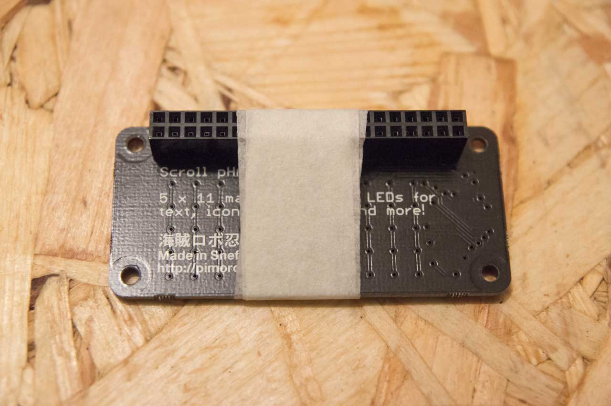
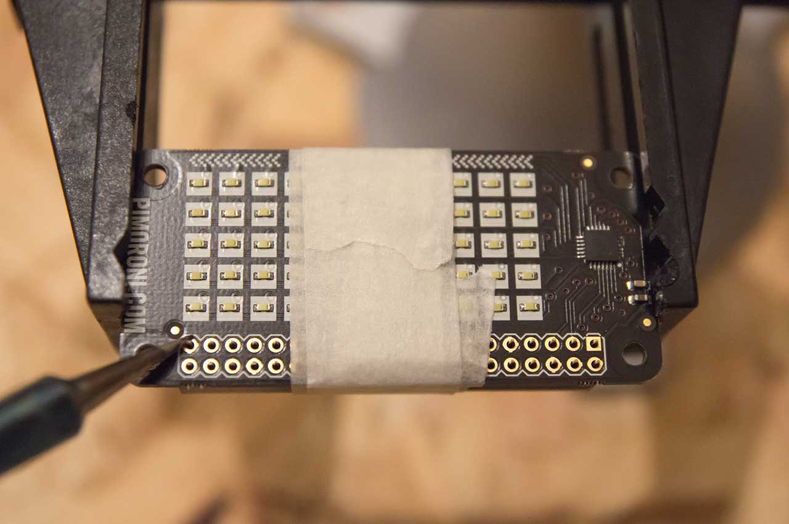
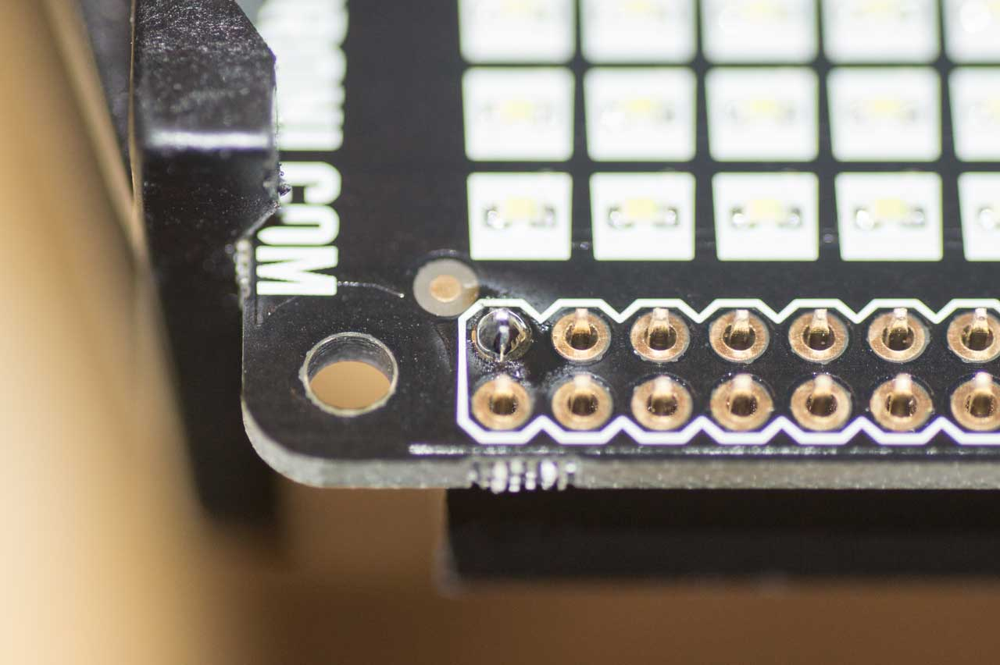
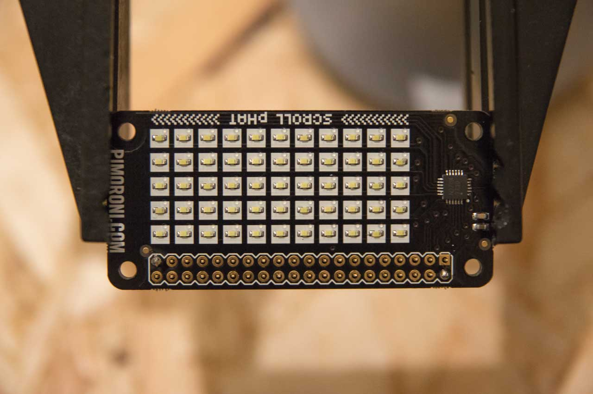
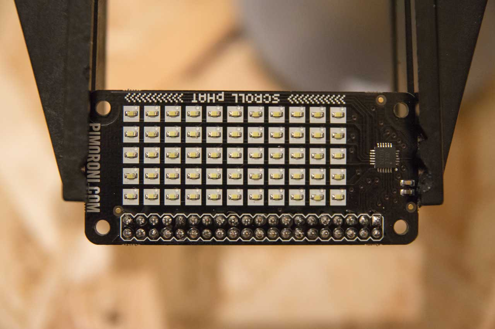

## Soldering Pi Zero pHATs

For this short tutorial, you'll need the following:

* A pHAT of your choice
* A 40 pin header (a female one is supplied with the pHAT)
* A soldering iron with a conical/pointed tip
* Lead-free solder
* A roll of masking tape
* Panavise (recommended, but not essential)

Here, we'll be soldering a female 40 pin header to the Scroll pHAT, but the same
rules apply whichever pHAT you have or if you're using a male, right-angle or
extra long female header. The female header will allow you to mount the pHAT to
a Pi Zero with male 40 pin header soldered on, or to a full-size Pi. An extra
long female header will allow you to stack another pHAT on top, for instance a
Scroll pHAT on top of a pHAT DAC.

## Preparing your soldering iron

Plug in your soldering iron and let it get nice and hot. I'd recommend leaving
it for about 5 minutes, but keep a close eye on it and make sure that it's
safely left in a soldering station or on a stand.

It's important to make sure that the tip of your iron is clean before you start.
If the tip looks dull and oxidised, then you can use a piece of fine-grit
sandpaper to remove that and expose the shiny metal tip again.

You should also tin your soldering iron tip before you start, by applying some
solder to the tip until it is covered in a thin, shiny layer of solder. This
will help the solder to melt and flow more easily.

## Preparing the pHAT for soldering

I like to use some masking tape to hold the header in place while I solder the
first couple of pins. It's important to use masking tape rather than Sellotape
or electrical tape, since any plastic tape will melt when the soldering iron is
near it or due to heat conducted through the PCB.

Stick the pins the protrude from the top of the female header through from the
bottom of the pHAT, so that they stick through the top of the PCB. If you're
using a male header, then use the shorter ends of the pins and leave the long
ends sticking downwards.

Now, hold the header in place and wrap a piece of masking tape right around the
header and pHAT to hold everything in place. Make sure that the header is
sitting straight and not squint. It should look something like the picture
below.

## Anchoring the corner pins

So that you can remove the masking tape and solder all of the pins, you should
solder the two opposite corner pins to anchor the header in place.

I like to use a Panavise to hold the PCB in place while I solder it, but if you
don't have one, you can use another piece of masking tape to hold it in place
on the surface on which you're working. The Panavise is great, because it
completely frees both hands and can be screwed down securely to a desk.

Once your soldering iron is hot and you have everything prepared, you can begin
to solder the corner pins. Hold the point of the iron so that it touches both
the pin and the copper surrounding the through-hole, as in the picture below.

Hold it there for a second or so to heat the pin and the copper contact on the
PCB. Now, with your other hand (I prefer to hold the iron in my right hand and
the solder in my left) bring the solder in to touch the point where the iron
meets the pin and let a blob of solder flow right round the pin and copper
contact. You've soldered your first corner pin!

Now, do the same with the opposite corner pin.

## Soldering the rest of the pins

Having secured the corner pins and hence the header, we can now remove the
masking tape and solder all of the other pins in the same way as above. When
you've finished it should look something like the picture below, with neat blobs
of solder on all 40 pins.

And that's it. Test your pHAT by installing its software and running an example.
Assuming it all works properly, you're good to go. If not, then check the solder
joints closely and re-solder any that look dodgy.
