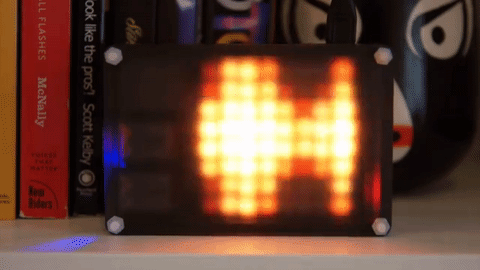
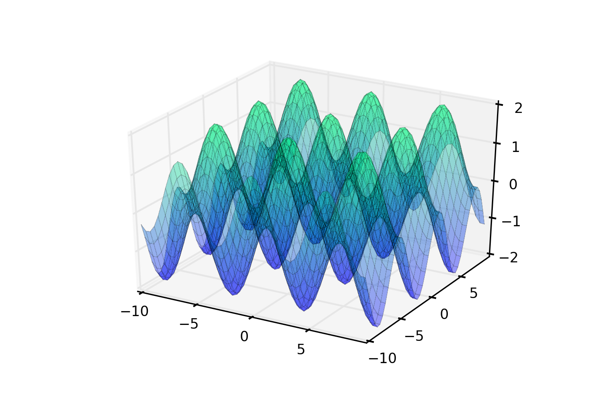

## Trigonometric patterns with Unicorn HAT

Here's a quick tutorial on how to create some pretty patterns with the Pimoroni
Unicorn HAT and your Raspberry Pi.



You probably remember trigonometry from school, when you used it to calculate
the angles inside a triangle. Well, it turns out that if you use trigonometric
functions to transform a set of x and y coordinates to z coordinates and then
plot them in 3D space, they look *really* cool. Below is a simple cos(x) +
sin(y) function. If we take those z coordinates and use them to control the
brightness of an LED matrix then you get some *funky* patterns.



## Setting it up

All you'll need is:

* A Raspberry Pi A+ or B+
* A Unicorn HAT

You'll need to do all of the following in the terminal. If you've booted
straight to the desktop, you'll find it in Menu -> Accessories -> Terminal.


As always, do a `sudo apt-get update` and `sudo apt-get upgrade` to get
everything up-to-date on your Raspberry Pi.

There's a one-line installer that will install the Unicorn HAT Python library.
Open a terminal, and then type the following:

```bash
curl -sS get.pimoroni.com/unicornhat | bash
```

You shouldn't need to reboot but, if anything isn't working as it should, it
can sometimes help to reboot.

## How it works

We have some boilerplate at the top of our script to import libraries that
we'll need, and to dial down the brightness of the LEDs a tad.

```python
#!/usr/bin/env python

import unicornhat as unicorn
import time, colorsys
import math

unicorn.brightness(0.5)
```

Our function to calculate the brightness values is pretty simple. It takes the
`x` and `y` coordinates of each LED and uses the `math.sin()` and `math.cos()`
functions from the math library to give us a value for the brightness.

As you'll see from the graph of the cos(x) + sin(y) function above, the limits
on the z axis are -2 and +2, so to get a brightness value between 0 and 1 we
just add 2 to the result of our trigonometric function and then divide by 4.

We also have a `t` value that we pass to the function. This allows us to
increment this value and vary the pattern through time by adding it to the
`x` and `y` values on each iteration.

Last of all, to mix things up a bit, we vary our sin + cos function to produce
three different patterns that I've called `parallel`, `diagonal` and
`crisscross`.

```python
def compute_z(x, y, t, pattern):
	x = x + t
	y = y + t
	if pattern == 'parallel':
		z = math.sin(x) + math.cos(x)
	elif pattern == 'diagonal':
		z = math.sin(x + y) + math.cos(x + y)
	elif pattern == 'crisscross':
		z = math.sin(x) + math.cos(y)
	z = (z + 2) / 4
	return z
```

The final part of our program uses a `while True` loop to keep things running
indefinitely. It loops through a list of our three patterns and runs each for
100 iterations. Then it loops through each `x` and `y` coordinate, calculates
the brightness values with our `compute_z` function and converts the HSV
(hue, saturation, value) values to RGB (red, green, blue) values. We set all of
the LEDs to their given values and then use a `time.sleep(0.05)` to control the
refresh rate which, in conjunction with the `for t in range(100)` loop, means
that each pattern will run for about 5 seconds.

```python
while True:
	for pattern in patterns:
		for t in range(100):
			for y in range(8):
				for x in range(8):
					h = 0.1
					s = 1.0
					v = compute_z(x, y, t, pattern)
					rgb = colorsys.hsv_to_rgb(h, s, v)
					r = int(rgb[0]*255.0)
					g = int(rgb[1]*255.0)
					b = int(rgb[2]*255.0)
					unicorn.set_pixel(x, y, r, g, b)
			unicorn.show()
			time.sleep(0.05)
```

You can get my `trig.py` script from
[my fork](https://github.com/sandyjmacdonald/unicorn-hat)
of Pimoroni's Unicorn HAT library as follows:

```bash
git clone https://github.com/sandyjmacdonald/unicorn-hat.git
cd unicorn-hat/python/examples
sudo python trig.py
```

Or if you already have the library and just want
[the script](https://gist.github.com/sandyjmacdonald/3971d222b7e74fbb5f7a):

```bash
git clone https://gist.github.com/3971d222b7e74fbb5f7a.git
sudo python trig.py
```

## Taking it further

This is just the start. You could use the sin and cos function to also
control the colour of each LED or just cycle through different colours.
Or, you could play around with the trig functions, altering them to create
even crazier patterns.
